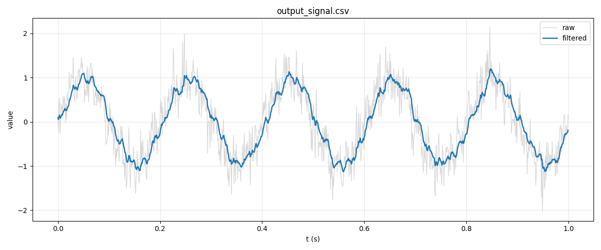
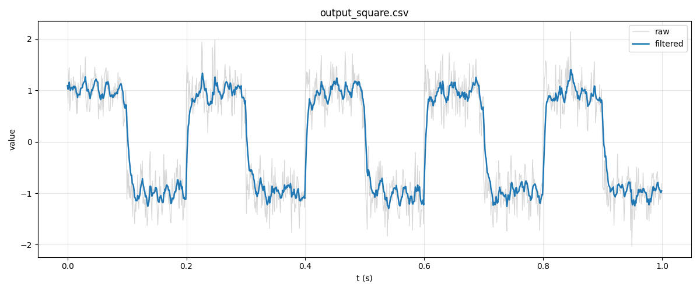

# ADCFilter

A lightweight C99 utility that smooths noisy ADC signals using an
**Exponential Moving Average (EMA)** low-pass filter. The same filter core
can be cross-compiled for a desktop (CSV streaming) or an embedded target
such as STM32 (in-place array processing) without any code duplication.

## What it does

`filter_tool` reads a two-column CSV (`t,value`) of raw ADC samples,
runs every sample through an EMA filter, and writes a three-column CSV
(`t,raw,filtered`) that can be plotted to compare the original signal
with the smoothed one.

## Why EMA?

EMA was chosen specifically because it is well-suited for a memory- and
compute-constrained MCU like the STM32:

| Property | Value | Why it matters on STM32 |
|---|---|---|
| Time complexity per sample | **O(1)** | Fits inside a DMA / timer ISR without missing deadlines. |
| Memory per filter instance | **~9 bytes(12 bytes aligned)** | No history buffer — unlike moving-average or FIR, which require a ring buffer of N samples. |
| Floating-point ops per sample | Comfortably handled by the Cortex-M FPU. |
| Streaming-friendly | No need to buffer the whole signal; ideal for continuous ADC + DMA. |

The recurrence is:

```
y[n] = alpha * x[n] + (1 - alpha) * y[n-1]
```

The first sample is stored as-is (`y[0] = x[0]`) so the filter does not
introduce a startup ramp from zero.

## Project layout

```
.
├── include/
│   ├── filter.h         # Opaque FilterState + public API
│   └── csv_parser.h     # Desktop-only CSV streamer
├── src/
│   ├── main.c           # CLI entry (DESKTOP_BUILD) / embedded helper (#else)
│   ├── filter.c         # EMA implementation (malloc or static pool)
│   └── csv_parser.c     # File I/O, line parsing
├── data/                # Input CSVs (signal.csv, square.csv)
├── viz/                 # Python + Matplotlib visualization
│   ├── plot_filter.py
│   └── requirements.txt
└── Makefile
```

The `filter` module is portable C99 with **no stdio dependency**. CSV
handling lives behind `#ifdef DESKTOP_BUILD` and is excluded from
embedded builds.

## Build

Using `make` (recommended):

```bash
make            # build ./filter_tool
make clean      # remove build artifacts
make run        # build then run a test filter on data/signal.csv with alpha=0.12
```

Or invoke `gcc` directly:

```bash
gcc -Wall -Wextra -std=c99 -DDESKTOP_BUILD -Iinclude \
    src/main.c src/filter.c src/csv_parser.c -o filter_tool
```

The build is warning-clean under `-Wall -Wextra`.

## Run

```
./filter_tool <input_file> <output_file> <alpha>
```

Examples:

```bash
# Smooth a noisy sinusoid
./filter_tool data/signal.csv data/output_signal.csv 0.12

# Smooth a square wave (shows the trade-off between
# noise rejection and edge response)
./filter_tool data/square.csv data/output_square.csv 0.20
```

On success the program prints `Done. Wrote <output> (alpha=...)` and
exits with code 0. On any error (missing file, bad arguments, alpha out
of range) it writes a diagnostic to `stderr` and exits with code 1.

## Choosing `alpha`

`alpha` is the only tunable parameter and must lie in **[0, 1]**.

| `alpha` | Behaviour |
|---|---|
| `1.0` | No filtering — output equals input. |
| `~0.5` | Light smoothing, fast response. |
| `~0.1–0.2` | Typical sweet spot for noisy ADC readings. |
| `~0.01` | Heavy smoothing, visibly lagging signal. |
| `0.0` | Output frozen at the first sample (degenerate). |

Rule of thumb:

- **Closer to 1** → less filtering, more noise passes through, but
  transitions (edges, steps) are tracked quickly.
- **Closer to 0** → stronger smoothing, much cleaner signal, but the
  filtered output lags behind real changes.

The equivalent first-order RC time constant can be calculated as:
$$\tau = \Delta t \cdot \frac{1 - \alpha}{\alpha}$$, where $\Delta t$ is the sampling period. This is extremely useful when porting a known analog cutoff frequency to the digital filter domain.
when porting a known analog cutoff frequency to the digital filter.

## Embedded usage (STM32)

When `DESKTOP_BUILD` is **not** defined:

- `filter.c` allocates `FilterState` instances from a small static pool
  (`FILTER_POOL_SIZE = 4`) instead of `malloc`/`free`.
- `csv_parser.*` is compiled out entirely.
- `main.c` exposes `filter_array_in_place(buffer, length, alpha)` as a
  reference integration point — call it from a DMA half/full-transfer
  callback to filter an ADC buffer in place.

```c
#define ADC_BUF_LEN 256
static float adc_buffer[ADC_BUF_LEN];

void on_dma_complete(void) {
    filter_array_in_place(adc_buffer, ADC_BUF_LEN, 0.12f);
    // adc_buffer now holds the smoothed samples
}
```

---

## Visualization (optional)

Not required for the project itself — just a convenience for inspecting
results. `viz/plot_filter.py` is a small Matplotlib script that plots the
raw signal against the filtered one. It accepts both the 3-column output
CSV (`t,raw,filtered`) and the 2-column input CSV (`t,value`).

### Setup (one-time)

A virtual environment is recommended on macOS, where the system Python
is locked down:

```bash
python3 -m venv viz/.venv
source viz/.venv/bin/activate
pip install -r viz/requirements.txt
```

### Run

```bash
# Filter first, then plot the result in an interactive window
./filter_tool data/signal.csv data/output_signal.csv 0.12
python viz/plot_filter.py data/output_signal.csv

# Save the plot to a PNG instead of opening a window
python viz/plot_filter.py data/output_signal.csv --save signal_filtered.png

# Custom title (useful when comparing different alpha values)
python viz/plot_filter.py data/output_square.csv --title "square wave, alpha=0.20"
```

### End-to-end one-liner

```bash
make && \
  ./filter_tool data/signal.csv data/output_signal.csv 0.12 && \
  python viz/plot_filter.py data/output_signal.csv
```

### Sample plots

Pre-rendered charts from the bundled CSVs are committed to `data/` so
the results can be inspected without setting up Python:

- `data/output_signal_chart.png` — noisy sinusoid, `alpha=0.12`
- `data/output_square_chart.png` — square wave, `alpha=0.20`




